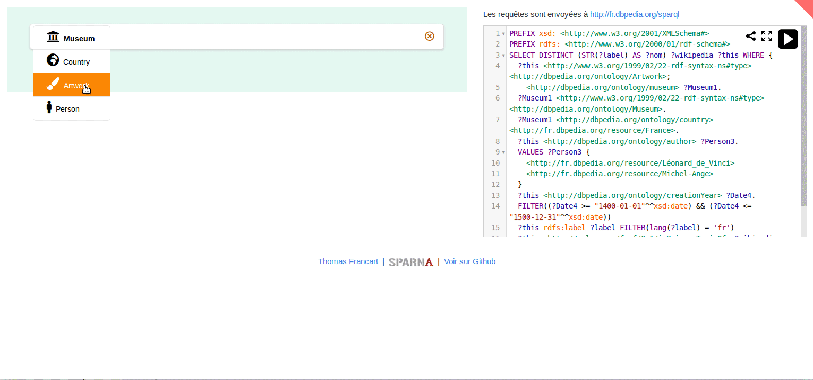
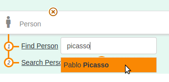
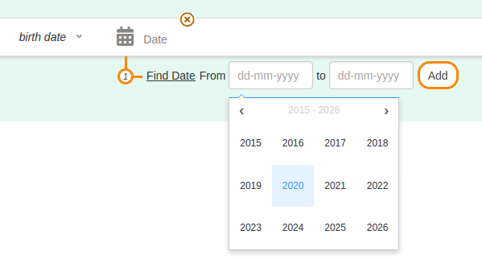

# Sparnatural - A natural way of building SPARQL queries

Sparnatural is a **visual SPARQL query builder written in javascript**.

It supports the creation of basic graph patterns with the selection of values with autocomplete search or dropdown lists. It can be configured through a JSON-LD ontology file that defines the classes and properties to be presented in the component.



You can play with an **online demo at http://labs.sparna.fr/sparnatural-demo-dbpedia/**.

# Getting Started

To get started :

1. Read the following documentation;
2. Look at how things work in file `sparnatural-demo-dbpedia/index.html`; 
   1. **Attention** : make sure you open this open through a web server, e.g. http://localhost/sparnatural-demo-dbpedia/index.html, and *not* by opening the file directly in your browser (`file://...`), otherwise the loading of component specification fails and your will get a blank page;
3. Look at how the specifications are written by looking at the source of `sparnatural-demo-dbpedia/index.html`
4. Adapt `sparnatural-demo-dbpedia/index.html` by changing the configuration and adapting the SPARQL endpoint URL;

# Features

## Query Structure

### Basic query pattern

Select the type of entity to search...


... then select the type of the related entity.


In this case there is only one possible type of relation that can connect the 2 entities, so it gets selected automatically. Then select a value for the related entity, in this case in a dropdown list :


Congratulations, your first SPARQL query criteria is complete !


Now you can fetch the generated SPARQL query :


### "WHERE"

This enables to navigate the graph :


### "AND"

Combine criterias :


### "OR"

Select multiple values for a criteria :


## Values selection

Sparnatural offers currently 6 ways of selecting a value for a criteria : autocomplete field, dropdown list, simple string value, date range (year or date precision), date range with a search in a period name (e.g. "bronze age"), or no selection at all.

### Autocomplete field



### Dropdown list


### String value (text search)


### Date range (year or date precision)



### Date range with search in period name

### No value selection

This is useful when a type a of entity is used only to navigate the graph, but without the ability to select an instance of these entities.


## Multilingual

Sparnatural is multilingual and supports displaying labels of classes and properties in multiple languages.


## Limitations

### Only basic graph patterns, no UNION, OPTIONAL, BIND, etc.

Sparnatural produces only basic graph patterns with VALUES. It does not support the creation of UNION, OPTIONAL, SERVICE, BIND, etc...

### SPARQL endpoint needs to be CORS-enabled

To send SPARQL queries to a service that is not hosted on the same domain name as the web page in which Sparnatural is included, the SPARQL endpoint needs to allow [Cross-Origin Resource Sharing (CORS)](https://enable-cors.org/).

# Integration

## Specification of classes and properties

The component is configurable using a JSON(-LD) ontology file. Look at the specification files under the `config` folders of the demos to get an idea. The file contains :

### Class definition

```json
    {
      "@id" : "http://dbpedia.org/ontology/Museum",
      "@type" : "Class",
      "label": [
        {"@value" : "Museum", "@language" : "en"},
        {"@value" : "Musée","@language" : "fr"}
      ],
      "faIcon":  "fas fa-university"
    },
```

### Property definitions with domains and ranges

```json
    {
      "@id" : "http://dbpedia.org/ontology/museum",
      "@type" : "ObjectProperty",
      "subPropertyOf" : "sparnatural:AutocompleteProperty",
      "label": [
        {"@value" : "displayed at","@language" : "en"},
        {"@value" : "exposée à","@language" : "fr"}
      ],
      "domain": "http://dbpedia.org/ontology/Artwork",
      "range": "http://dbpedia.org/ontology/Museum",
      "datasource" : "datasources:search_rdfslabel_bifcontains"
    },
```

### Using font-awesome icons

It is possible to directly use font-awesome icons in place of icons embedded in your application :

```json
"faIcon":  "fas fa-user",
```

## How to integrate Sparnatural in a webpage

Have a look at `index.html` in the demos folder to see how the component is integrated in a webpage.


## Map the query structure to a different graph structure

Map classes or properties in the config to a corresponding SPARQL property path or a corresponding class URI, using the `sparqlString` JSON key, e.g. :

```
    {
      "@id" : "http://labs.sparna.fr/sparnatural-demo-dbpedia/onto#bornIn",
      "@type" : "ObjectProperty",
      ...
      "sparqlString": "<http://dbpedia.org/ontology/birthPlace>/<http://dbpedia.org/ontology/country>",
    },
```

Then call `expandSparql` on the `sparnatural` instance by passing the original SPARQL query, to replace all mentions of original classes and properties URI with the corresponding SPARQL string :

```
queryString = sparnatural.expandSparql(queryString);
```
