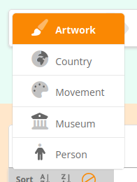
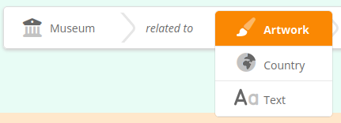
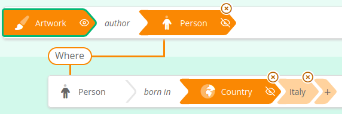
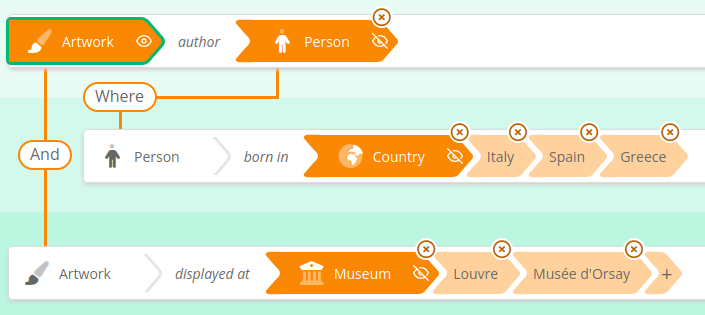
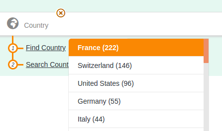
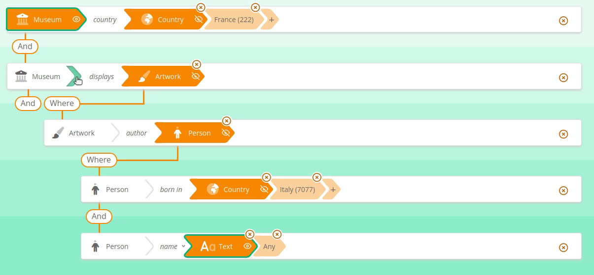

# Sparnatural SPARQL query builder
Sparnatural is a **visual client-side SPARQL query builder** for exploring and navigating RDF Knowledge Graphs. It is written in Typescript.

It supports the creation of basic graph patterns with the selection of values with autocomplete search or dropdown lists, or other widgets. It can be configured through an OWL or SHACL configuration file that defines the classes and properties to be presented in the component.


You can play with **online demos at http://sparnatural.eu#demos**.

# Getting Started

To get started :

1. Read the following README;
2. Read [the documentation](https://docs.sparnatural.eu)
3. Look at how things work in the ["Hello Sparnatural folder"](https://github.com/sparna-git/Sparnatural/tree/master/hello-sparnatural) that demonstrates a simple integration against the DBPedia endpoint; 
4. In particular look at [the OWL configuration file](https://github.com/sparna-git/Sparnatural/blob/master/hello-sparnatural/config.ttl) that defines the classes and properties used in this page;
5. Adapt this configuration and the endpoint URL in the index.html webpage if you want to test on your own data;

# Features

## Query Structure

### Basic query pattern

Select the type of entity to search...



... then select the type of the related entity.



In this case there is only one possible type of relation that can connect the 2 entities, so it gets selected automatically. Then select a value for the related entity, in this case in a dropdown list :


Congratulations, your first SPARQL query criteria is complete !


Now you can fetch the generated SPARQL query :


### "WHERE"

This enables to navigate the graph :



### "AND"

Combine criterias :


### "OR"

Select multiple values for a criteria :



(UNIONs are not supported)

## Values selection

Sparnatural offers currently 9 ways of selecting a value for a criteria :
- dropdown list widget
- autocomplete search field
- tree browsing widget
- map selection widget
- string search widget, searched as regex or as exact string
- date range widget (year or date precision)
- numeric values widget
- boolean widget
- no value selection (useful for 'intermediate' entities)

### Dropdown list widget



### Autocomplete search widget


### Tree browsing widget


### Map selection widget


### String search widget (text search)


### Date range widget (year or date precision)


### Numeric values widget


### Boolean widget


### No value selection

This is useful when a type a of entity is used only to navigate the graph, but without the ability to select an instance of these entities.


## Multilingual

Sparnatural is multilingual and supports displaying labels of classes and properties in multiple languages.

## Support for OPTIONAL and FILTER NOT EXISTS

Sparnatural supports the `OPTIONAL` and `FILTER NOT EXISTS {}` keywords applied to a whole "branch" of the query.
See here how to search for French Museums and the name of Italian painters they display, _if any_ :




## Support for SERVICE keyword

There is currently an [experimental support for the SERVICE keyword](http://docs.sparnatural.eu/Federated-querying.html) for federated querying.

## Support for Aggregation queries

Since version 9.0.0, Sparnatural supports `COUNT` queries and other aggregation functions.

## Limitations

### No UNION or BIND

Sparnatural does not support the creation of UNION, BIND

### SPARQL endpoint needs to be CORS-enabled

To send SPARQL queries to a service that is not hosted on the same domain name as the web page in which Sparnatural is included, the SPARQL endpoint needs to allow [Cross-Origin Resource Sharing (CORS)](https://enable-cors.org/). But we have a [SPARQL proxy](http://docs.sparnatural.eu/SPARQL-proxy.html) for those who are not, don't worry ;-)

# Integration in a webpage

1. Look at the [hello-sparnatural folder](https://github.com/sparna-git/Sparnatural/tree/master/hello-sparnatural) that demonstrates a simple integration
2. Read [this page in the documentation](https://docs.sparnatural.eu/Javascript-integration).
3. Look at a [typical demo page on DBPedia](https://github.com/sparna-git/sparnatural.eu/tree/main/demos/demo-dbpedia-v2)


# Configuration

## Specification of classes and properties

Since 9.0.0, the preferred way to configure Sparnatural is with a **SHACL specification**. Look at the [supported SHACL features in the documentation](http://docs.sparnatural.eu/SHACL-based-configuration.html).

The component is also configurable using a an [OWL configuration file](https://docs.sparnatural.eu/OWL-based-configuration) editable in Protégé. Look at the specification files of [the demos](https://github.com/sparna-git/sparnatural.eu/tree/main/demos) to get an idea. 


### Class definition in OWL

```turtle
    :Museum rdf:type owl:Class ;
        rdfs:subClassOf core:SparnaturalClass ;
        core:faIcon "fad fa-university" ;
        core:sparqlString "<http://dbpedia.org/ontology/Museum>" ;
        core:tooltip "A <b>DBPedia Museum</b>"@en ,
                     "Un <b>Musée DBPedia</b>"@fr ;
        rdfs:label "Museum"@en ,
                   "Musée"@fr .
```

### Property definitions with domains and ranges in OWL

```turtle
:displayedAt rdf:type owl:ObjectProperty ;
             rdfs:subPropertyOf core:AutocompleteProperty ;
             owl:inverseOf :displays ;
             rdfs:domain :Artwork ;
             rdfs:range :Museum ;
             core:sparqlString "<http://dbpedia.org/ontology/museum>" ;
             datasources:datasource datasources:search_rdfslabel_bifcontains ;
             rdfs:label "displayed at"@en ,
                        "exposée à"@fr .
```

### Using font-awesome icons

It is possible to directly reference an icon class from font-awesome if you embed them in your application :

```turtle
    :Person rdf:type owl:Class ;
        core:faIcon "fad fa-male" ;
```

## Map the query structure to a different graph structure

The OWL file to use is **different** from your knowledge graph ontology definition. You should create a different OWL file. You can refer to the [documentation page](https://docs.sparnatural.eu/OWL-based-configuration.html) for more details.

Classes or properties in the config can either:
- use the same URI as a class or a property in your knowledge graph.
- be mapped to a corresponding SPARQL property path or a corresponding class URI, using the `core:sparqlString` annotation.

Here is an example of a simple property in a Sparnatural configuration that is mapped to a property path in the underlying knowledge graph:

```turtle
    :bornIn rdf:type owl:ObjectProperty ;
        rdfs:subPropertyOf core:ListProperty ;
        rdfs:domain :Person ;
        rdfs:range :Country ;
        core:sparqlString "<http://dbpedia.org/ontology/birthPlace>/<http://dbpedia.org/ontology/country>" ;
```
