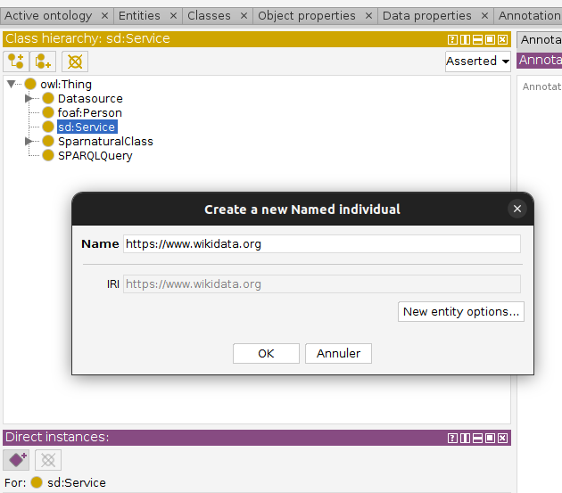
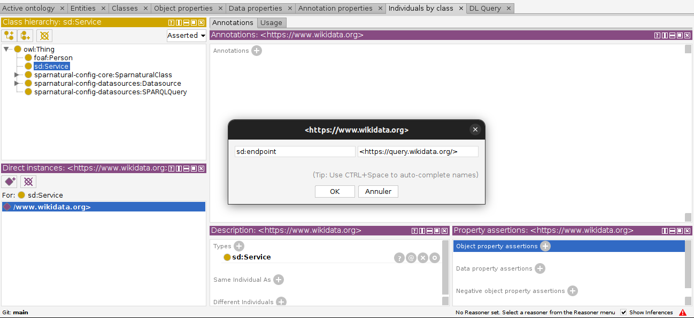
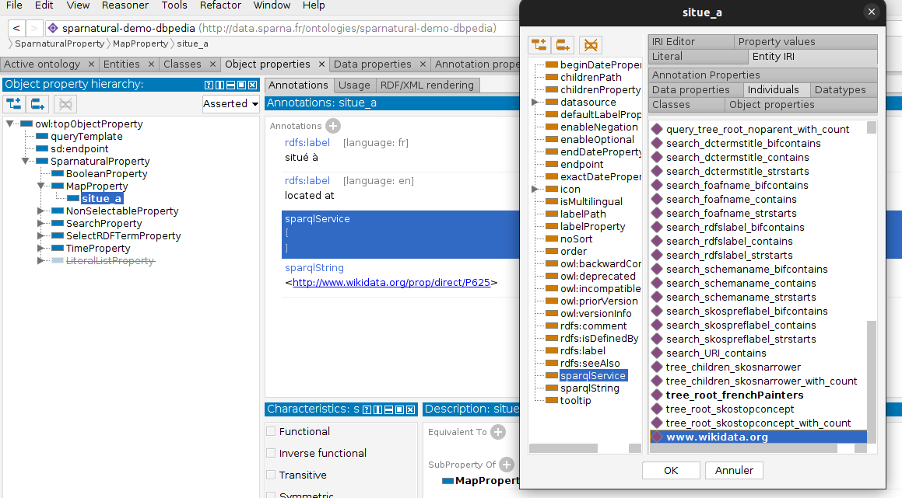
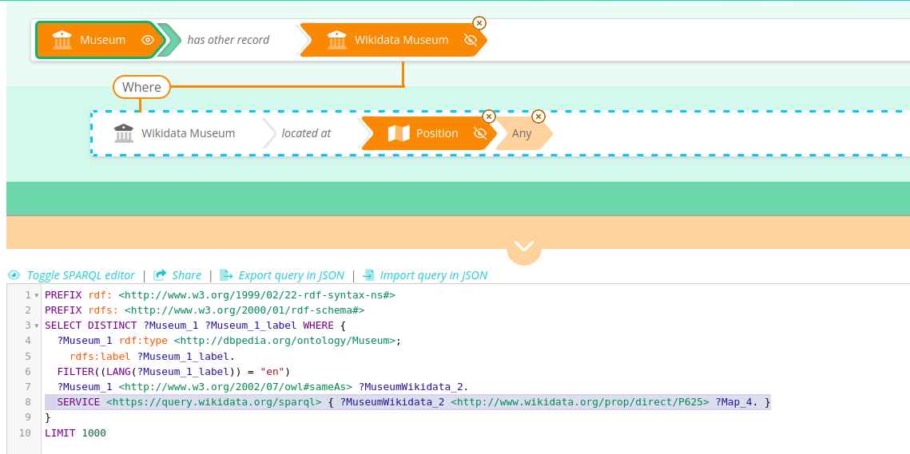

_[Home](index.html) > Querying date ranges_

# Federated query support (SERVICE keyword)

## The problem

SPARQL and semantic web in general have the capacity to work in distributed contexts and to resolve queries against *more than one SPARQL endpoint*. Yet this is complicated to comprehend for a user, and even more complicated for a user to specify which part of its query should be routed to which SPARQL service.

## The solution

Starting with v8, Sparnatural provides basic support for federated querying using the `SERVICE` keyword. The idea is that federated querying will be activated for certain properties in your configuration, that you need to configure in advance. Once configured, the use of federated querying will be transparent for the user, who will not have to set anything when writing its query.

In order to configure federated querying, you need to :
1. Declare the endpoint to which you want to send the federated queries, by creating an instance of `sd:Service`
2. Indicate the SPARQL endpoint URL of this service using the `sd:endpoint` property
3. Link *specific properties* in your configuration to this endpoint using the `core:sparqlService` annotation.

In the queries involving these specific properties, all the "branch" of the query using this property will automatically be surrounded with a `SERVICE` keyword.

We will illustrate this configuration with federated queries on Wikidata.

## The short, simple, Turtle way

If you edit the configuration in Turtle, a configuration could like this:

```turtle
TODO
```

## Declare an instance of sd:Service

`sd:Service` is a class declared in the [SPARQL Service Description](https://www.w3.org/TR/sparql11-service-description/#sd-Service) vocabulary. It is included for you in the Sparnatural configuration ontology, so you don't have to add an import.

In Protégé, create an instance of that class, and give it the URI you want, for example `https://www.wikidata.org` :



## Declare the endpoint URL

While the Service URI can be anything you like, you need to formally declare the technical URL at which the service listens using the `sd:endpoint` property on this instance.

in Protégé you are force to first declare an instance of owl:Thing with the URL to be able to further select it (if you edit your configuration manually you don't need to do that).

Create an instance of owl:Thing and give it the precise URL of the SPARQL endpoint, in our case `https://query.wikidata.org/` :


Then come back to your Service individual, edit it and add an object property assertion with predicate `sd:endpoint` and value `https://query.wikidata.org/`. In Protégé you are forced to switch to first switch to "View > Render by prefixed name" in order to be able to select your endpoint URL:




## Link a property to the service

Now that our service is ready, we can indicate that a property in our configuration should be routed to that Service. We do that with the `core:sparqlService` property. For example we could imagine that a property to fetch the geographic coordinates uses federation to fetch the geometry from Wikidata:



Note how:
- we select the service www.wikidata.org, not the URL https://query.wikidata.org
- Our property is mapped to `<http://www.wikidata.org/prop/direct/P625>` which is the property identifier in Wikidata holding geo coordinates

## and... TADAM !

Now when a query is issued involving this property, it is automatically wrapped in a SERVICE clause using the endpoint URL:



`
