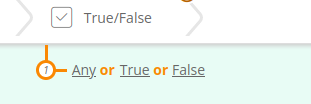

# How to create your own widget

Sparnatural offers a range of different widgets for sparql value selection. Further Widget can be added by implementing extending the `AbstractWidget` class. Let's create the BooleanWidget to demonstrate the implementation process:

## 1. Create new widget Class
Go to the widget folder `./src/sparnatural/components/widgets/`
We will create a new Class extending from Abstract Widget:
```
import { Pattern } from "sparqljs";
import { AbstractWidget, WidgetValue } from "./AbstractWidget";
export class BooleanWidget extends AbstractWidget {
    getRdfJsPattern(): Pattern[] {
        throw new Error("Method not implemented.");
    }
    parseInput(value: { label: string; }): WidgetValue {
        throw new Error("Method not implemented.");
    }
}
```
With the help of some intellisense we can see that the two methods `getRdfJsPattern` and `parseInput` must be implemented.

`getRdfJsPattern`: Returns an Array of type `Pattern[]`. This is based on the [sparqljs datamodel](https://github.com/RubenVerborgh/SPARQL.js/). This `Pattern[]` is what will be converted to sparql.

`parseInput`: Returns a WidgetValue and has two functions. It is used to parse the input given by the user and it parses string input when a query is imported.

Let's first proceed with rendering the html of the widget. The `AbstractWidget` itself inherits from the HTMLComponent class which is the top class for all Sparnatural Components. Each component can therefore implement the `render()` method to render some HTML.
```
super.render();
    let trueSpan = $(
      `<span class="boolean-value">${getSettings().langSearch.true}</span>'`
    );
    let orSpan = $(`<span class="or">${getSettings().langSearch.Or}</span>`);
    let falseSpan = $(
      `<span class="boolean-value"">'${getSettings().langSearch.false}</span>`
    );
    this.html.append(trueSpan).append(orSpan).append(falseSpan);
    trueSpan[0].addEventListener("click", (e) => {
      let widgetValue: BooleanWidgetValue = new BooleanWidgetValue({
        label: getSettings().langSearch.true,
        boolean: true,
      });
      this.renderWidgetVal(widgetValue);
    });
    falseSpan[0].addEventListener("click", (e) => {
      let widgetValue: BooleanWidgetValue = new BooleanWidgetValue({
        label: getSettings().langSearch.false,
        boolean: false,
      });
      this.renderWidgetVal(widgetValue);
    });
    return this;
```
This renders to the following and has some clickListener to listen for the click:



Noticable above is the widgetValue creation inside the click listener. This leads us to the next requirement SparnaturalWidgets have. Each Sparnatural widget SHOULD come with a "*data class*". This data class needs to inherit from the WidgetValue Interface:
```
export class BooleanWidgetValue implements WidgetValue {
  value: {
    label: string;
    boolean: boolean;
  }
  key():string {
    return this.value.boolean.toString();
  }
  constructor(v:BooleanWidgetValue["value"]) {
    this.value = v;
  }
}
```